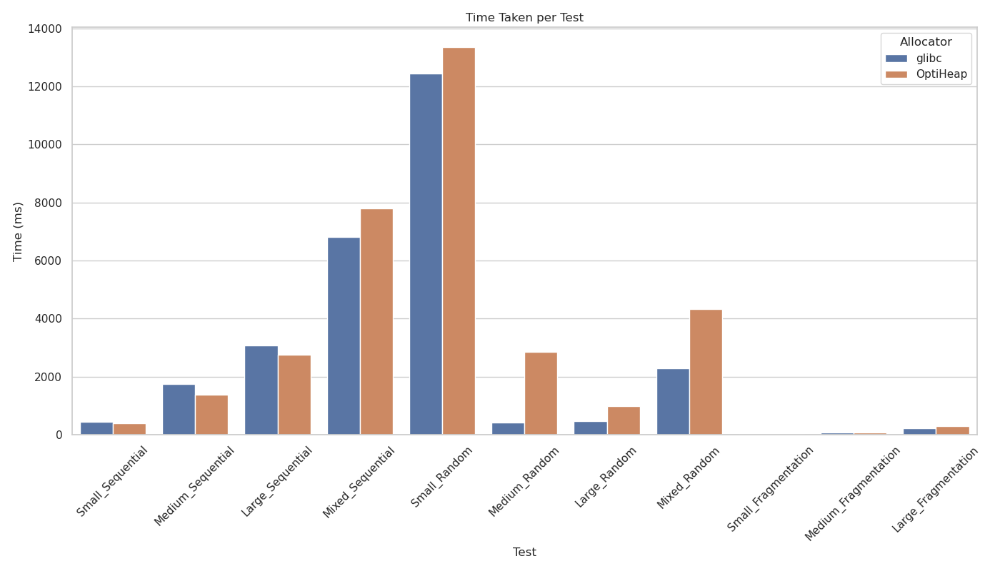
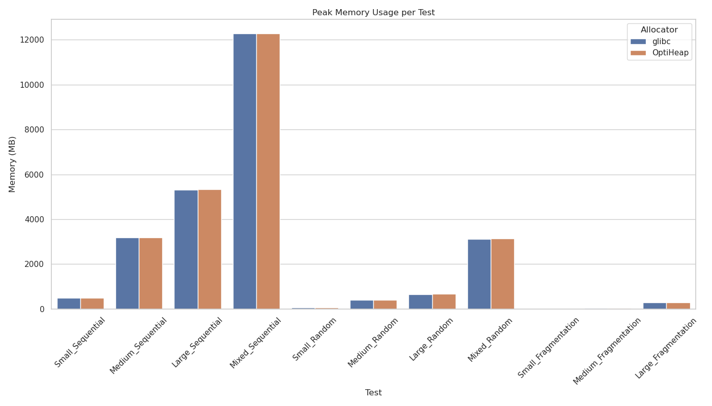

# OptiHeap — A Hybrid Memory Allocator in C

> A modular, high-performance memory allocator that combines heap-based and mmap-based allocation with optional reference counting, thread safety, and debugging support.

---

## Features

- Hybrid allocation: `heap` for small blocks, `mmap` for large ones
- Optional reference counting with `retain` / `release` APIs with destructor support
- Thread-safe mode with `pthread_mutex` locking
- Heap and mmap state visualization via debug printing
- Elaborate error messages that ease the process of debugging
- Benchmarking against `glibc malloc`
- Fully modular and easy to extend

---

## Architecture Overview

| Module | Responsibility |
|--------|----------------|
| `optiheap_allocator.c` | Top-level API. Routes requests to heap or mmap allocator |
| `heap_allocator.c`     | Manages small blocks via segregated free lists |
| `mmap_allocator.c`     | Handles large allocations with page-aligned `mmap()` |
| `reference_counting.c` | Smart-pointer-like layer (optional) |
| `memory_structs.h`     | Common memory header with metadata, magic bytes, and links |

[Full architecture documentation](docs/architecture.md)

---

## Installation

### Compile with GCC

Set the required optiheap flags in the makefile based on requirements
```
make libraries
```
The default no-flag configuration creates a lean and minimal memory allocation library that largely focusses of performance.

To remove the existing library build use
```
make clean
```

### Library usage example

include the header file `./include/optiheap_allocator.h` in your source code

Using the static library
```
gcc Your_source_code_that_uses_the_library.c ./lib/liboptiheap.a -o Executable_name
```

---

## Compile-Time Flags

These are the flags that must be used in the makefile before building the library.

| Flag                            | Description                                       |
| ------------------------------- | ------------------------------------------------- |
| `-DOPTIHEAP_DEBUGGER`           | Enables verbose memory state printing             |
| `-DOPTIHEAP_REFERENCE_COUNTING` | Enables smart-pointer support                     |
| `-DOPTIHEAP_THREAD_SAFE`        | Adds `pthread_mutex` locking to critical sections |

**Note***: These flags can largely help the enduser but they drain the allocator's performance to do what they do, especially the debug flag. Enabling of the debug flag increases the amounts of safety checks in the source code that can be used to ensure that the code written by the programmer using the library is safe and for this reason it is `highly recommended to use the debug flag in production` but, always construct the `final deployment build without the debug flag` to ensure performance.

---

## Benchmark Results

Benchmarked using a custom suite comparing against glibc malloc.




[Elaborate Benchmarking results of the latest version](benchmarks/Benchmarking_results_version4/combined_benchmark_results.csv)

The library has seen a series of improvements to achieve the desired performance

| Version Number | Throughput against glibc | Modifications Made |
| -------------- | ------------------------- | ------------------ |
| 1 | 59.1 % slower | Base Design where the allocator had a lot of check, used a single freelist with best fit |
| 2 | 22.3 % slower | Replaced single freelist + bestfit with segregated freelists with 11 size classes + firstfit |
| 3 | 12.9 % slower | Made debugging and thread-safety an optional feature to reduce the number of unproductive operations |
| 4 | 1.5 % slower | Optimized the block coalescing that happens in heap allocator whenever a block is freed |

The repository also contains some profiling data done with `perf`.

[You can check that here](perf_data/perf.data)